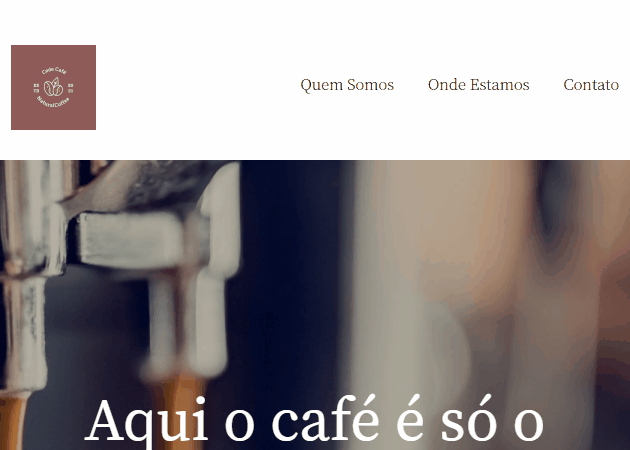

# Projeto de Estudo - Landing Page Café☕

### Clique no GIF para abrir o site👆

## Por que eu fiz esse projeto?🤗

Fiz esse projeto no intuito de colocar em prática meus estudos iniciais de HTML e CSS,fazendo assim algo simples mas que seja algo bonito e agradável aos olhos de quem vê.

## Quais as dificuldades que eu tive?🤔

A principal dificuldade que eu passei foi em relação a organização dos elementos, principalmente para deixar o site responsivo para celular e tablets. Outra dificuldade que eu tive que enfretar foi em relação ao próprio HTML, muitas vezes acabei colocando algumas tags fora do lugar por não ter me organizado totalmente, mas logo arrumei de um jeito que não me atrapalhou de conseguir fazer o projeto.

## Tecnologias utilizadas💻

- HTML
- CSS
- Git
  
## Conclusão😎

Depois de ter feito o projeto, aprendi a me organizar melhor no HTML, a usar melhor as tags semânticas que são bastante necessárias e vencer o principal problema que eu tive, ter medo de começar a fazer o primeiro projeto achando que iria ser um fracasso, entretanto depois de colocar a mão na massa, percebi que mesmo que no começo pareça que não vai dar certo, persistência e foco, você consegue realizar o que deseja.

